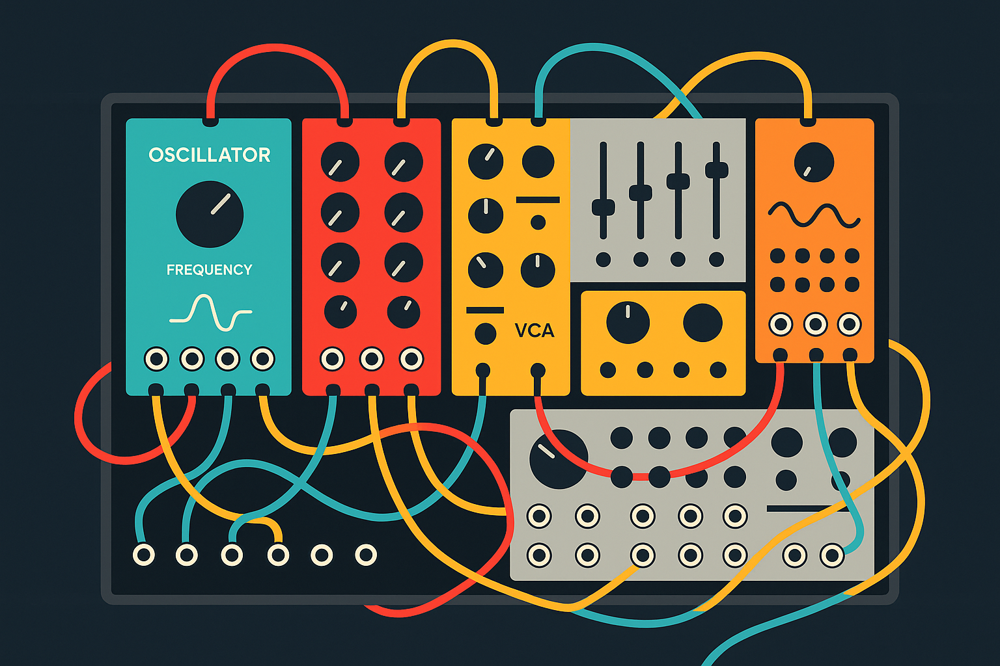

# S O I R

[](http://github.com/badges/stability-badges)

Soir is an environment for audio live-coding.

```
    Night wraps around code
    Loops and arrays take their shape
    Keyboard's gentle song
```


