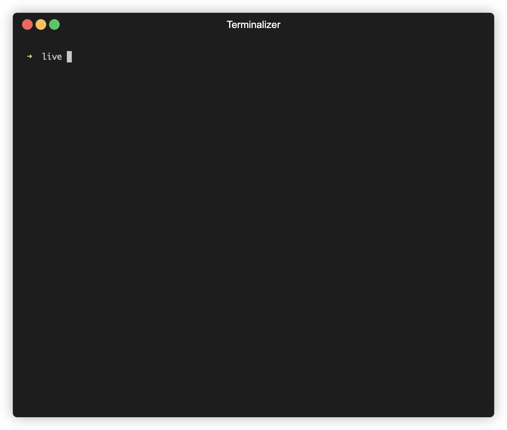

# Quick Start

## Checking installation

To check your installation and dependencies:

```bash
soir info
soir check-deps
```

## Your first live session

You can use the `soir new` and `soir run` commands to create and run a new soir session:


Then in another terminal, start live coding by opening the `live.py` file from the session directory:


